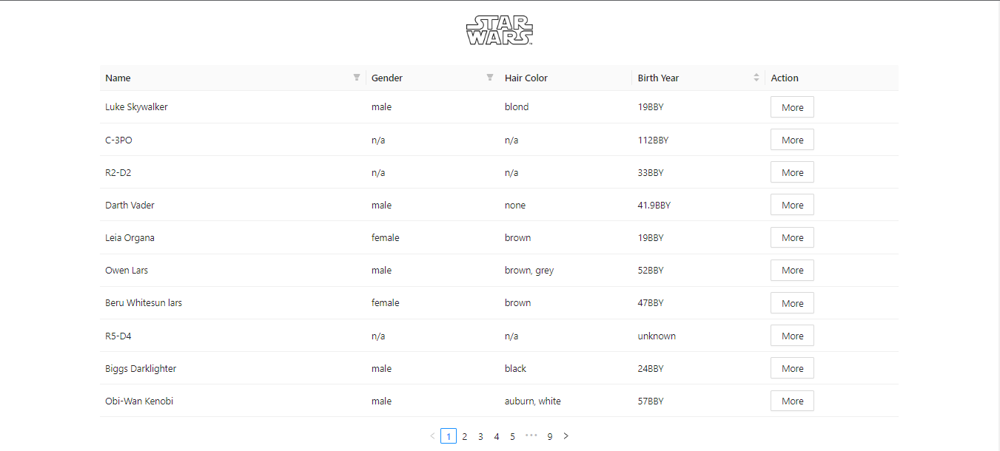

# Star Wars App
En un solo lugar encontraras toda la información relacionada a tus personajes favoritos



## Instalación ⚙️
***
Una pequeña introducción sobre la instalación.
```
$ git clone https://example.com
$ cd ../path/to/the/file
$ npm install
$ npm start
```

## Despliegue 📦
- [Star Wars App](https://mascotas-geek.netlify.app/)

## Estructura de carpetas 📂
```
├───📁 public/
│   └───📄 index.html
├───📁 src/
│   ├───📁 assets/
│   │   ├───📄 star_wars_app_desktop_home.png
│   │   └───📄 star_wars_app_desktop_modal.png
│   ├───📁 components/
│   │   └───📄 TabletCharacters.jsx
│   ├───📁 containers/
│   │   └───📄 Home.jsx
│   ├───📁 helpers/
│   │   ├───📄 getData.js
│   │   └───📄 getPlanet.js
│   ├───📁 routes/
│   │   └───📄 AppRoutes.js
│   ├───📁 styles/
│   │   └───📄 styles.js
│   └───📄 index.js
├───📄 .gitignore
├───📄 package-lock.json
├───📄 package.json
└───📄 README.md
directory: 8 file: 14
```